# Trigger an Order Ack IDoc in AP ECC6(On-premise) using the hybrid connection and Send 855(EDI Purchase Order Ack) in B2B cloud using AS2.

Let us consider a use case where a hotel chain, Hilton, would like to send business documents to its partner using webMethods B2B Cloud. The partner, Costco, is a supplier of organic food items. It uses different document types like purchase orders, Purchase Orders and other food industry specific documents.
Costco is the partner which receives the Purchase Order Ack 855 EDI file over AS2 protocal. As an enterprise, Hilton should configure webMethods B2B cloud to enable the exchange of 
business documents with its partner. 
This design time configuration can be performed using B2B cloud UI. This involves creation of:
	Enterprise profile (A profile that represents the hotel chain)
	Partner profile (Profile that represents the partner)
	Partner users
	Communication channels
	Processing rules
	
## Prerequisites
1. You need Software AG webmethods.io B2B cloud tenant and webmethods.io integration cloud tenant. If you don't have one; sign up for free 30 trial tenant at [Software AG B2B](https://signup.softwareag.cloud/#/?product=b2b)

2. You should have Software AG on-premise Integration Server agent with SAP Adapter.

3. You should have access to on-premise SAP Ecc6/any sap system which supports JCO libraries to connect via webmethods sap adapter.

4. For triggering IDoc from SAP you should have configured the testing tool in SAP Logon client.

## Transaction Flow
1. SAP Logon sends the IDoc ORDER Ack from SAP ECC6
2. Configure the SAP Conncetion and SAP Listener to receive the IDoc Order 05 in Integration Server On-Premise.
3. The SAP Routing Listner should invoke the specific Intergartion Server service which will intern invoke the webmethods.io flow editor service.
4. The flow editor service Process855OrderAck will send the edi message to B2B cloud.
5. B2B cloud executes the action defined in processing rule which is configured to send the outbound edi message via partner preffered channel.
6. Partner preffered outbound channel is configured as AS2 channel in Partner profile Costco
	

## Design time configuration

### Setup SAP Logon client testing tool
We have SAP Logon client which will trigger the IDoc from SAP-ECC6. You need to set up testing tool for testing this functionality.

### Configure SAP Adapter and Listener
Login to Integration Server where we have SAP adapter installed and configured. Please check the SAP Adapter developer guide for this configueration under https://empower.softwareag.com/

Setup the SAP connection to connect to SAP ECC6 instance and enable the connection.

Setup the SAP Listener to receive the IDoc from SAP and enable the listener. Here we should set up the project specific listener.

Setup the SAP listner notification for the sender, receiver and document type. Then enable the ntificationin admin page.

Under SAP Listener notification set up the execution mode as service invoke and invoke the IS service which intern invoke the webmethods.io flow service.

### Setting up enterprise and partner profile
To setup a profile for the enterprise (Hilton), Click Set up my B2B Enterprise on the welcome screen to open the guided wizard.
Enter the Name and Organization Unit of the enterprise.

Click Add Identity to add information on identities.

The next screens request you to add information about contacts and addresses. This information is necessary for the partner to communicate the enterprise.
Once the enterprise profile is created, you will see that it is set to Active by default.

### Create partner profile
Partners are a group of organizations that have agreed to exchange business documents. In order to identify these partners, partner profiles need to be created.

To create a new partner, click Add Partner in Partner profiles section.

Create a partner Costco with DUNS number as the identity type.

As you can see, a partner profile is Not Active by default. Once all the required configurations are done, we can activate the profile.

### Create partner user
Only authorized users of a partner can send documents to B2B Cloud.
To create a partner user, click Add Partner User in Partner users section.

Create a partner user sam along with password information.

### Channels-Creating Inbound channels
A channel forms the basis of communication in B2B Cloud and facilitates document exchange.
There are two types of channels - Inbound (to receive documents) and Outbound (to send documents).

In Channels section, click Add Channel and choose Inbound Channel.
Choose the Channel type as AS2 and provide the name and description.

Once the channel is created, you will see that the channel is Active by default. Also, note the HTTP endpoint URL which will be used by the partner to send documents.
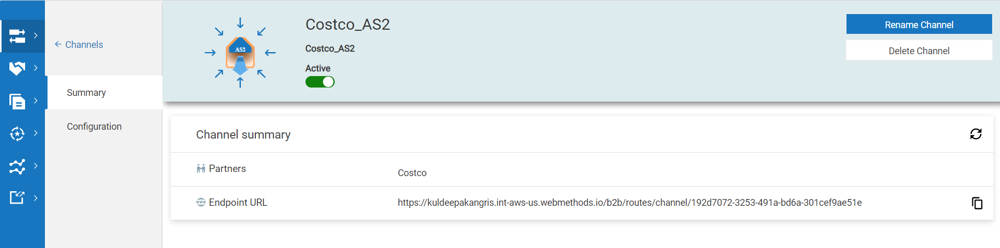

### Associations-Associate partner user with partner profile
To send a document to B2B Cloud, a partner must have at least one partner user associated with it.
Let us now associate the user sam with partner Costco.
Go the Users section of the profile page of Costco, click Associate User and add the user "sam".

### Associations-Associate inbound channel with partner profile
You should associate an inbound channel with a partner to receive business documents through the configured endpoint.
Here, we need to associate the inbound channel Costco_AS2 with partner Coscto.
Go the Inbound channels section of the profile page of Costco, click Associate Inbound Channel and add the channel "HTTP-Inbound-Channel".

### Activate partner profile
Activate the partner profile of Costco by enabling the Active toggle in the partner profile Summary page.

### Business documents
Generate the X12 4010 850 document by clicking on add documnet and select edi in drop down. 

Then select the Standard=X12, Version=4010 and Transaction=850 and click on save.
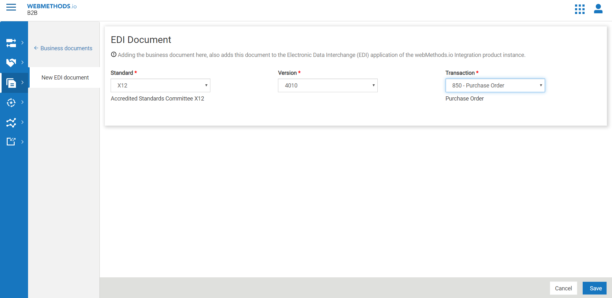
The 850 Purchase Order document will be generated and activated.

### Proccesing Rule-Create processing rule
Processing rules specify how you want B2B Cloud to process the inbound documents and the specific actions to take after a document matches with the specified criteria. They get executed in the order of precedence.

In order to place the new rule first in the sequence, click on the first rule in the list, click Add Processing Rule and choose Above.
Enter the Name and Description of the rule. Note that the Sequence of the rule is First.

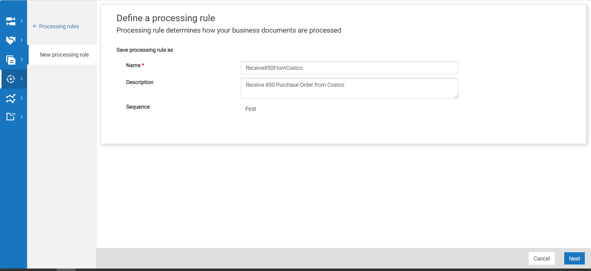

### Proccesing Rule-Configure criteria
The criteria defines who the sender and receiver should be, the type of document allowed, etc.
Choose the sender as Costco and the receiver as Enterprise (which is Hilton, in our case).
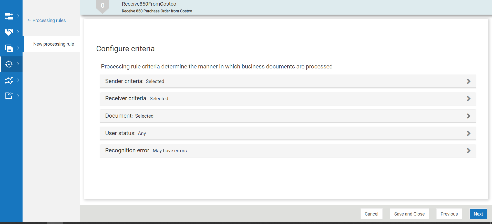

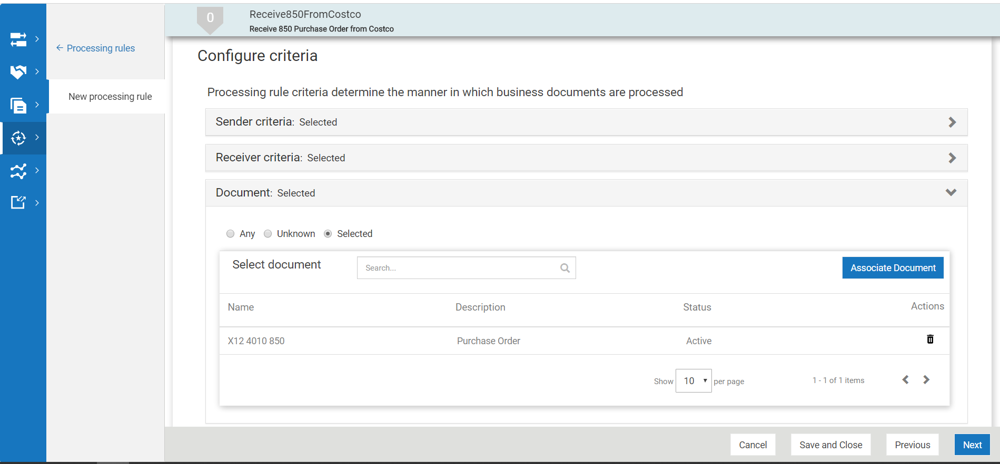

### Proccesing Rule-Configure pre-processing options
These options are used for performing operations prior to the actual processing actions.
Let us continue with the default selection that is present. The selection Defer to business document means the value provided in the business document will be considered.

### Proccesing Rule-Configure action
These are actions that will be executed once the criteria is met and the pre-processing is completed.

We shall configure the action Call an integration. This will enable B2B Cloud to call an integration URL on webMethods Integration Cloud using valid credentials.

Enter the integration URL, Username and Password. Reliable execution mode is chosen by default (This mode automatically retries failed integration).
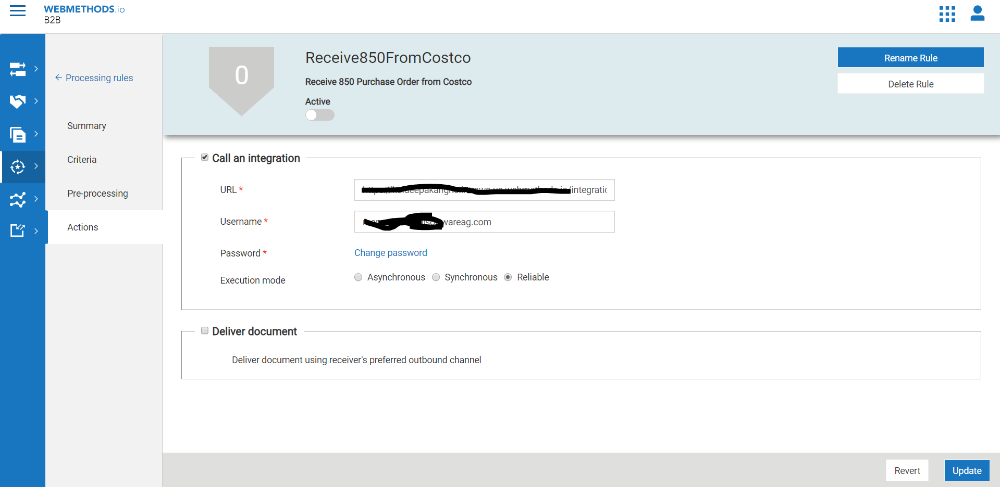

### Proccesing Rule-Activate processing rule
By default, any newly created processing rule is not activated. Activate the processing rule High Priority Rule by enabling the Active toggle in the Summary page.
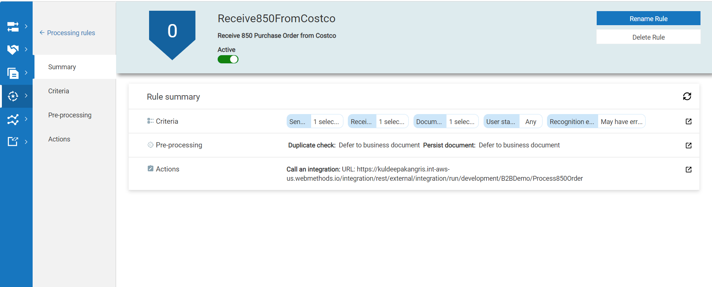

### Create Hybrid connection between IS On-premise and webmethods.io cloud tenant.

1.Login to Integration Server instance
	Before we can start creating the hybrid integration, we need to connect the Integration Server instance with your webMethods.io Integration account where you want to execute the workflows.
	To do so, login to your Integration Server instance, click webMethods Cloud menu listed in the left-side panel, and click Settings option.
	Enter the following details in the Settings screen that appears:
	User Name: Enter the email ID of your webMethods.io integration account.
	Password: Enter the password of your webMethods.io integration account.
	webMethods Cloud URL: Enter the complete tenant URL of your webMethods.io Integration account.
	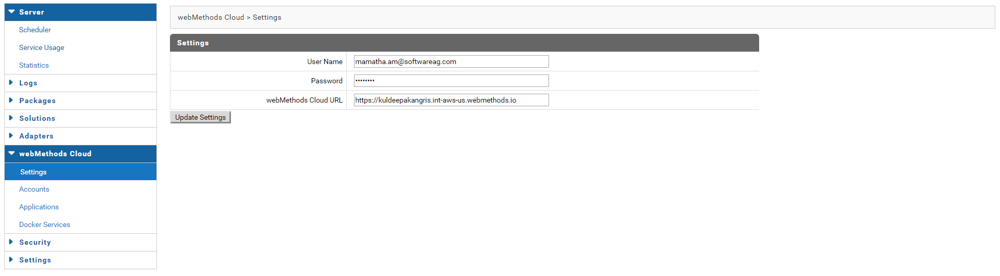
	
2.Create account on on-premise Integration Server
	An account on the on-premise Integration Server acts as a two way communication channel for data transfer between the on-premise Integration Server and webMethods.io Integration.
	So, when you execute the application uploaded on webmethods.io Integration, it in turn invokes the application instance deployed on the on-premise Integration Server where the actual execution takes place. The output/response of this execution is then sent back to webMethods.io Integration.
	To create a new account, navigate to webMethods Cloud > Accounts, and click on Create On-Premise Account link.
	
	

3.Create Application
	You need to create the applications you want to execute using webMethods.io Integration on the Integration Server. Once created, these applications can then be uploaded on to webMethods.io Integration where they can be used in workflows.
	To create an application, navigate to webMethods Cloud > Applications and click on Define webMethods Cloud Application link.
	
	
4:Upload the created application on webMethods.io Integration
	Once you have created an application, you need to upload it to webMethods.io integration in order to use it in your workflow. When you upload an application to webMethods.io integration, the metadata of its services such as name, description, and Input/Output Signature is also uploaded to the said application.
	To upload the application, navigate to webMethods Cloud > Applications, locate the application you want to upload in the webMethods Cloud Applications list, and click on the Upload icon.
	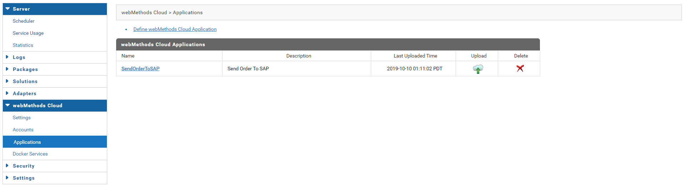
	
With this, you have successfully created the application in your webMethods Integration Server which can be used in your webMethods.io integration flow editor.
After this, whenever you login to your webMethods.io Integration account, you will find the uploaded application in the Connectors panel in the webmethods.io flow editor.
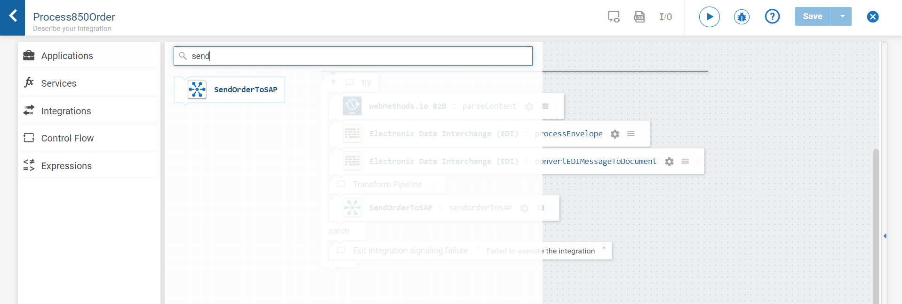

On-Premise sendOrderToSAP service uses the SAP connection to send the IDoc to SAP. 
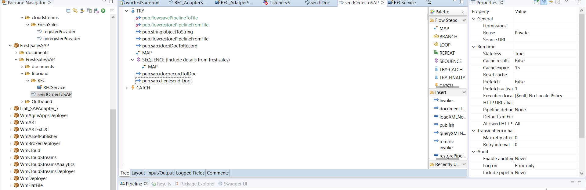

### We shall configure the service under the same project(B2BDemo) called "Process850Order" which does the below operations.
	1.Parse the EDI content by invoking parseContent Service
	2.Process the envelope message to get the envelope details(sender,receiver,message type, etc)
	3.Convert the EDI message to XML document.
	4.map the Purchase Order XML data to SendOrderToSap service which gets executed on-premise.
	
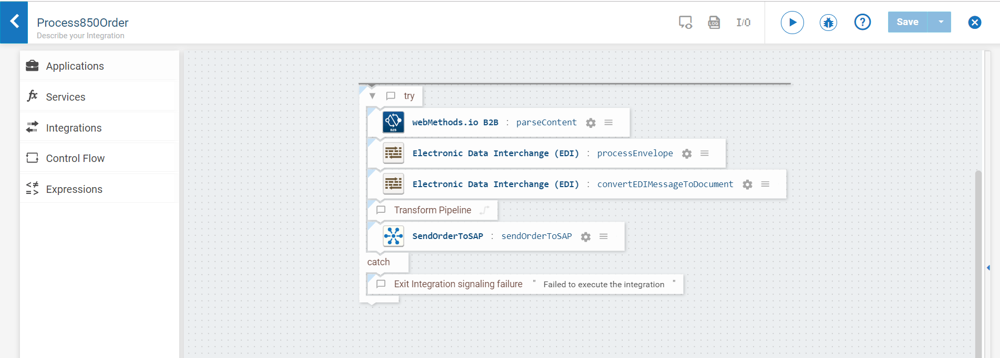 
	
## Sharing details to partners
You need to share the inbound channel endpoint details with the partner in order for them to send documents. A partner can use any HTTP client to send a business document to the endpoint URL.

Share endpoint and user details to partner
Details that need to be shared are - Endpoint URL and Partner User Credentials.

You will find the endpoint URL of the inbound channel and user credentials in the partner profile summary page of Coscto.

In our example, the endpoint URL is https://b2btenant.webmethodscloud.com/b2b/routes/channel/ebf06578-f698-4675-aeaa-1b6d8742bbf4 and partner user is sam.

## Testing
Sending document to an inbound channel

Now that we have configured an inbound channel and associated it with a partner profile, we will be able to send an EDI document to this channel's endpoint
1. Open Postman client
2. Select HTTP AS2 POST method
3. Specify the AS2 request URL as the inbound channel's endpoint URL
4. Under Authorization, set the Authorization to Basic Auth and specify the username and password configured as the partner user 	credentials
 
5. Under Headers, set Content-Type header as application/edi-x12 and you need to set AS2 specific headers

6. Under Body, choose the type as raw and paste the below document content

7. Send or submit the request. You should receive a 200 OK response

## Monitoring
Please login to B2B cloud and goto Transactions and observe the the transaction and also login to concur and check whether expense has been created.

B2B Cloud Transaction monitoring

webMethods.io flow editor monitoring

Order creation in SAP ECC6

