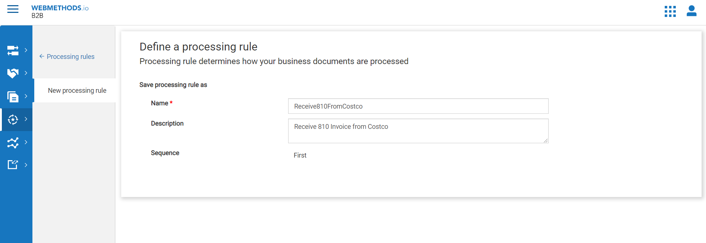
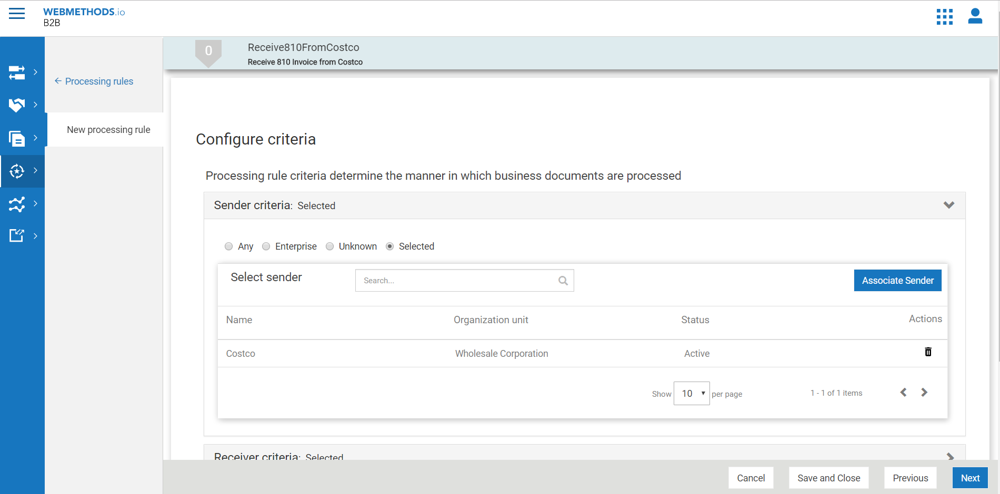
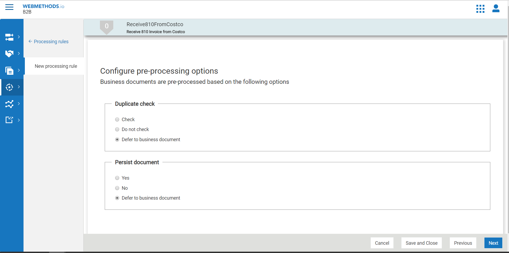
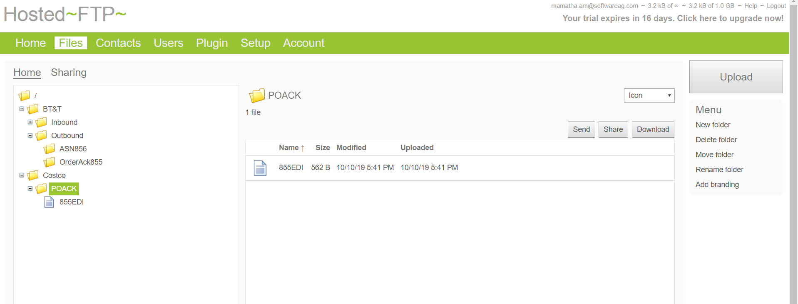

# Trigger an Order Ack IDoc in AP ECC6(On-premise) using the hybrid connection and Send 855(EDI Purchase Order Ack) in B2B cloud using FTP.

Let us consider a use case where a hotel chain, Hilton, would like to send business documents to its partner using webMethods B2B Cloud. The partner, Costco, is a supplier of organic food items. It uses different document types like purchase orders, Purchase Orders and other food industry specific documents.
Costco is the partner which receives the Purchase Order Ack 855 EDI file over FTP protocal. As an enterprise, Hilton should configure webMethods B2B cloud to enable the exchange of 
business documents with its partner. 
This design time configuration can be performed using B2B cloud UI. This involves creation of:
	Enterprise profile (A profile that represents the hotel chain)
	Partner profile (Profile that represents the partner)
	Partner users
	Processing rules
	
## Prerequisites
1. You need Software AG webmethods.io B2B cloud tenant and webmethods.io integration cloud tenant. If you don't have one; sign up for free 30 trial tenant at [Software AG B2B](https://signup.softwareag.cloud/#/?product=b2b)

2. You should have Software AG on-premise Integration Server agent with SAP Adapter.

3. You should have access to on-premise SAP Ecc6/any sap system which supports JCO libraries to connect via webmethods sap adapter.

4. For triggering IDoc from SAP you should have configured the testing tool in SAP Logon client.

5.You should have a FTP server to reeive the acknowledgement messsages.

## Transaction Flow
1. SAP Logon sends the IDoc ORDER Ack from SAP ECC6
2. Configure the SAP Conncetion and SAP Listener to receive the IDoc Order 05 in Integration Server On-Premise.
3. The SAP Routing Listner should invoke the specific Intergartion Server service which will intern invoke the webmethods.io flow editor service.
4. The flow editor service Process855OrderAck will send the edi message to B2B cloud.
5. B2B cloud executes the action defined in processing rule which is configured to call webmethods.io Integration for further mapping. The integration does the following
	-Receive EDI 855 file
	-Parse EDI 855 file
	-Extract the 855 EDI Purchase Order ack fine and send it to Costco via FTP protocal.
	

## Design time configuration

### Setup SAP Logon client testing tool
We have SAP Logon client which will trigger the IDoc from SAP-ECC6. You need to set up testing tool for testing this functionality.

### Configure SAP Adapter and Listener on Integration Server on premise
Login to Integration Server where we have SAP adapter installed and configured. Please check the SAP Adapter developer guide for this configueration under https://empower.softwareag.com/

Setup the SAP connection to connect to SAP ECC6 instance and enable the connection.

Setup the SAP Listener to receive the IDoc from SAP and enable the listener. Here we should set up the project specific listener.

Setup the SAP listner notification for the sender, receiver and document type. Then enable the ntificationin admin page.

Under SAP Listener notification set up the execution mode as service invoke and invoke the IS service which intern invoke the webmethods.io flow service.

### Setting up enterprise and partner profile
To setup a profile for the enterprise (Hilton), Click Set up my B2B Enterprise on the welcome screen to open the guided wizard.
Enter the Name and Organization Unit of the enterprise.

Click Add Identity to add information on identities.

The next screens request you to add information about contacts and addresses. This information is necessary for the partner to communicate the enterprise.
Once the enterprise profile is created, you will see that it is set to Active by default.

### Create partner profile
Partners are a group of organizations that have agreed to exchange business documents. In order to identify these partners, partner profiles need to be created.

To create a new partner, click Add Partner in Partner profiles section.

Create a partner Costco with DUNS number as the identity type.

As you can see, a partner profile is Not Active by default. Once all the required configurations are done, we can activate the profile.

### Create partner user
Only authorized users of a partner can send documents to B2B Cloud.
To create a partner user, click Add Partner User in Partner users section.

Create a partner user sam along with password information.

### Associations-Associate partner user with partner profile
To send a document to B2B Cloud, a partner must have at least one partner user associated with it.
Let us now associate the user sam with partner Costco.
Go the Users section of the profile page of Costco, click Associate User and add the user "sam".

### Activate partner profile
Activate the partner profile of Costco by enabling the Active toggle in the partner profile Summary page.

### Business documents
Generate the X12 4010 855 document by clicking on add documnet and select edi in drop down. 

Then select the Standard=X12, Version=4010 and Transaction=855 and click on save.

The 855 Purchase Order document will be generated and activated.

### Proccesing Rule-Create processing rule
Processing rules specify how you want B2B Cloud to process the inbound documents and the specific actions to take after a document matches with the specified criteria. They get executed in the order of precedence.

In order to place the new rule first in the sequence, click on the first rule in the list, click Add Processing Rule and choose Above.
Enter the Name and Description of the rule. Note that the Sequence of the rule is First.

### Proccesing Rule-Configure criteria
The criteria defines who the sender and receiver should be, the type of document allowed, etc.
Choose the sender as Costco and the receiver as Enterprise (which is Hilton, in our case).

### Proccesing Rule-Configure pre-processing options
These options are used for performing operations prior to the actual processing actions.
Let us continue with the default selection that is present. The selection Defer to business document means the value provided in the business document will be considered.

### Proccesing Rule-Configure action
These are actions that will be executed once the criteria is met and the pre-processing is completed.
We shall configure the action Call an integration which will deliver the 855 PO ack over ftp protocal. As of today in B2B only http and AS2 is supported protocals. So we will use the service to deliver the document via FTP.
This will enable B2B Cloud to call an integration URL on webMethods Integration Cloud using valid credentials.

Enter the integration URL, Username and Password. Reliable execution mode is chosen by default (This mode automatically retries failed integration).

### Proccesing Rule-Activate processing rule
By default, any newly created processing rule is not activated. Activate the processing rule High Priority Rule by enabling the Active toggle in the Summary page.

### Processing Service in webmethods.io flow editor des the following action. You can use HTTP/AS2 for delivering the document as well. In this case it is FTP protocol.
    -Receive EDI 855 file
	-Parse EDI 855 file
	-Extract the 855 EDI Purchase Order ack fine and send it to Costco via FTP protocal.

### We shall configure the service under the same project(B2BDemo) called "Process855OrderAck" which does the below operations.
	1.Convert the xml document to EDI 855 message
	2.EDI add the group envelope
	3.EDI add Interchange envelope
	4.submit the data to B2B cloud
	
 

## Testing
Sending document from SAP Logon to Costco FTP server

Now that we have configured an ftp server folder to receive the PO Ack document from SAP.
1. Open SAP Logon client and login to SAP ECC6 system

2. Trigger the IDoc using the testing tool.

3.You should be able to see the transaction using transaction monitoring screen in B2B.

## Monitoring
Login to Integration server admin page and goto SAP adapter to monitor the transactions

Login to webmethods.io flow editor and in analyticals see the service invocation of  "Process855OrderAck" and "Deliver855ToCostcoViaFTP"

B2B Cloud Transaction monitoring

Since we have used the FTP inbound channel of other tenant as outbound channel here it should send the 855 order ack to other tenant.
Login to the FTP inbound channel tenant and see the transaction monitoring.

