# Send a Purchase Order EDI 850 based on Alarm from Cumulocity

This examples highlights that how an Alarm generated using [Cumulocity](https://www.softwareag.cloud/site/product/cumulocity-iot.html) platform can be easily converted to an EDI document and sent back to the Enterprise partner for further processing. In this example, Cumulocity is monitoring a Tank and reporting content level back. There is a Smart Rule which is constantly monitoring the Tank Level and raises an alarm as soon as content goes below critical level. Once the alarm is raised, a workflow is triggered on wm.io platform which then creates an EDI 850 document and routes that document to Partner via B2B cloud. Many manufacturers are moving into a continuous manufacturing model, using a setup like this can help them achieve their goals.

Contributors: Shashank Patel, Mangat Rai

## Prerequisites
1. You need Software AG webmethods.io B2B cloud tenant, webmethods.io integration cloud tenant and cumulocity cloud tenant. If you don't have one; sign up for free 30 trial tenant at [Software AG B2B](https://signup.softwareag.cloud/#/?product=b2b)

This tutorial assume that you already have a device connected with cumulocity platform and have smart rule created to raise alarm on Tank Level.

2. Create your enterprise Partner profile on B2B Cloud. Provide identifiers to identify your Enterprise uniquely.

## Transaction Flow
1. Cumulocity raises an alarm once the Quantity in Tank goes below a certain threshold.
2. A workflow in wm.io gets triggered based on the alarm generated in previous step.
3. Workflow invokes a hybrid service to query on prem SAP ECC system to get details about partner, material, quantity etc needed to create EDI 850 document.
4. Workflow invokes Salesforce create Case Action and create a case in Salesforce for tracking of Purchase Order.
5. Workflow executes a flow editor service.
	- Maps 850 EDI business document.
	- Convert business document to EDI data.
	- Submit EDI 850 Purchase Order to B2B using submit inbuilt service. 
6. B2B cloud will route document to partner using sender\receiver id, Partner profile and outbound channel defined in B2B Cloud.

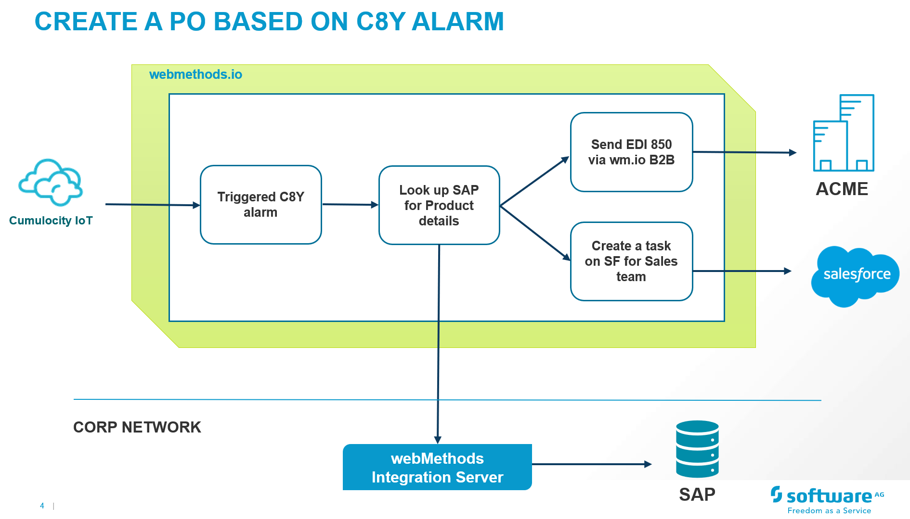

## Tutorial Steps
1. Login to your cumulocity instance. Find you device and copy device Id.

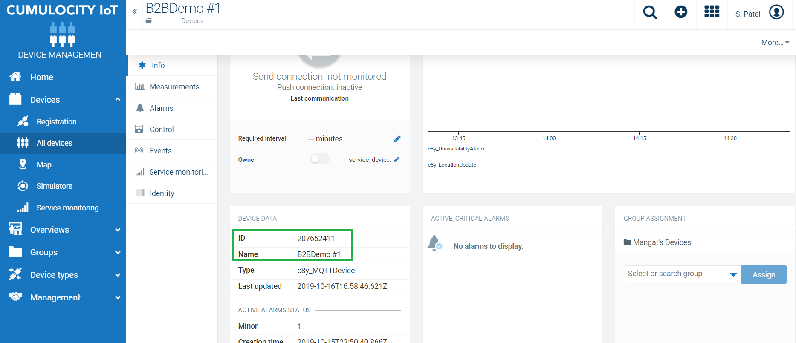

2. Create a workflow in wm.io. Check [tutorial](https://github.com/SoftwareAG/webmethodsio-examples) on how to create workflow in wm.io

3. Create a Cumulocity Trigger which listens to Alarm as starting point for this newly created workflow.

	Cumulocity Alarm Trigger
	

4. Next step is invoke a hybrid Service to look up tank details from on premise SAP ECC. To setup hybrid service login to your on prem Integration Server and follow next steps
	
	a. Setup SAP Connection to connect with your ECC system.
	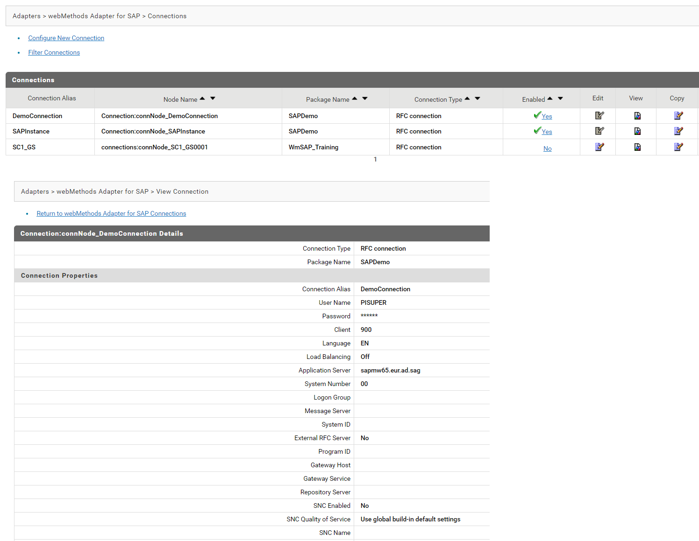
	
	b. Setup Cloud connection with your wm.io instance. provide your wm.io cloud tenant url, username and password.
	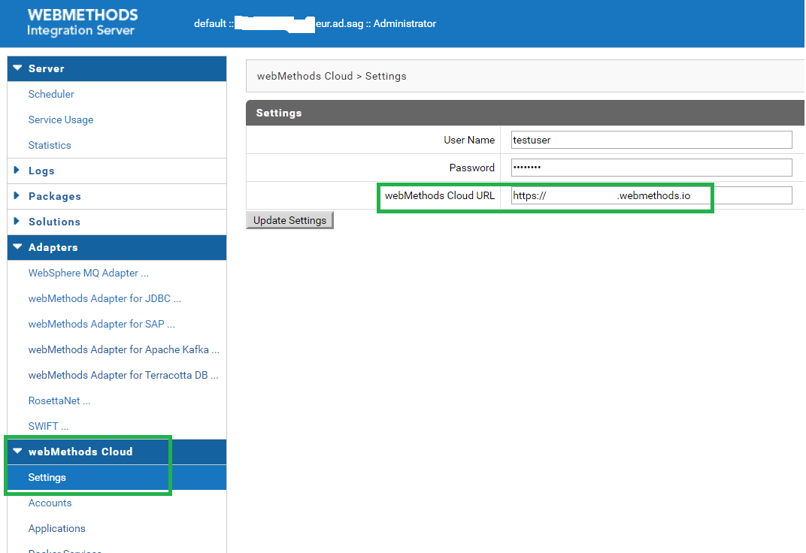
	
	c. Create Hybrid cloud application to publish to your wm.io cloud tenant.
	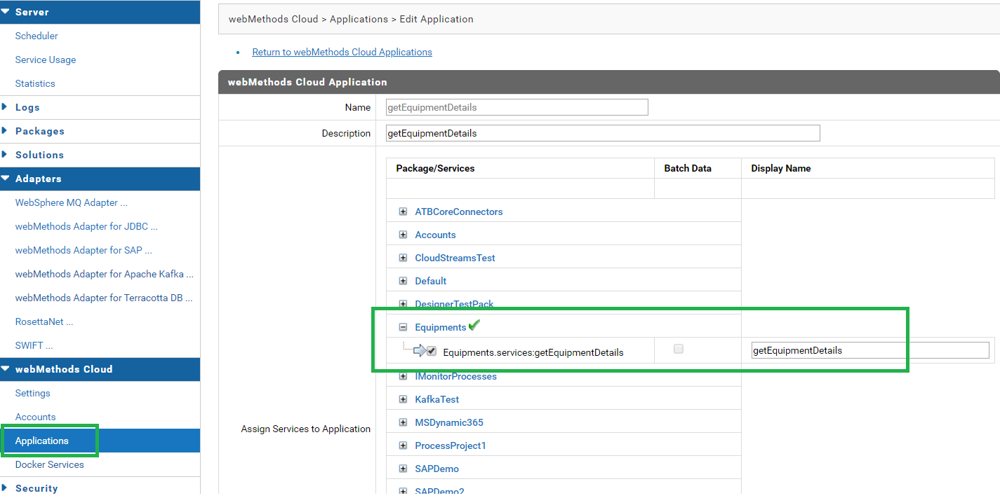
	
	d. Once app is published, it will start showing up in Action menu on right hand side of workflow canvas.

5. Drag and drop this hybrid Action on to the canvas. Map Device ID to hybrid action.
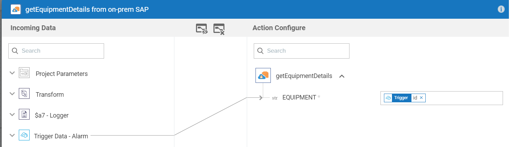

6. Next is create Salesforce Task. Drag and drop Salesforce CRM action from right hand side to canvas and map as below.
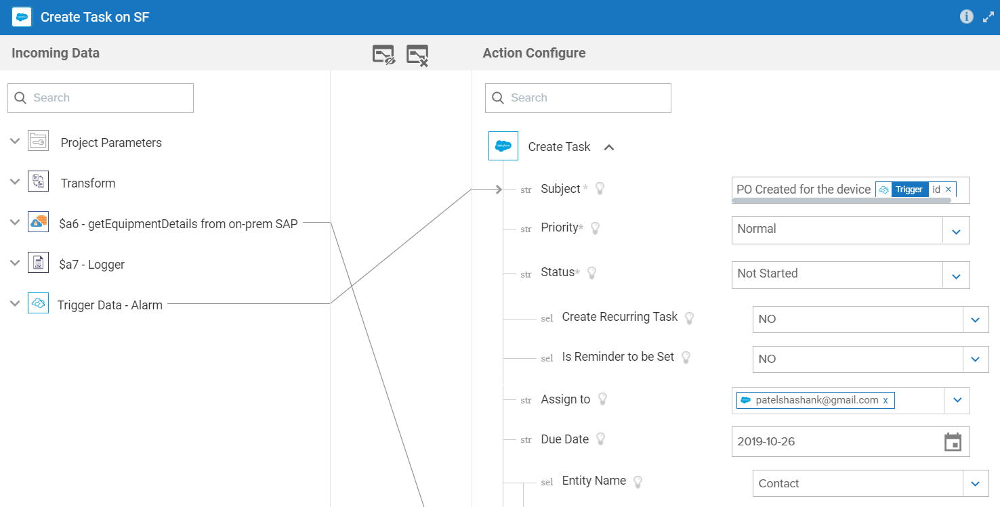

7. Before going to next step we have to create an Advanced integration in Flow Editor to map EDI and submit to B2B. Also B2B assets such document, partner etc needs to be created.

8. First let's create all the B2B assets

	a. Add an EDI 850 business document. This process will create a document type in webMethods Flow Editor , so it will be available easily for edi 850 mapping flow service.
	

	
	
	b. Create an outbound HTTP/HTTPS channel on Software AG B2B Cloud which is open for outbound HTTP/HTTPS communication to Partner ACME.

	
	
	c.Create a partner profile. Before this the assumption is you have already created an Enterprise for your company to receive files. Setting an Enterprise is a one time setup

	ACME Partner setup
	
	

9. Let's Create an Integration on webmethods.io Flow Editor which accepts inputs from cumulocity alarm and sap look up services and create and EDI 850 document to submit to partner.

- Switch to flow editor

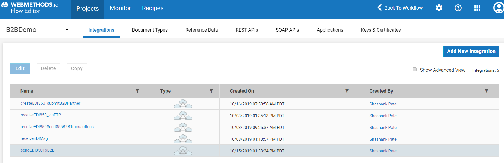

- Define inputs like below

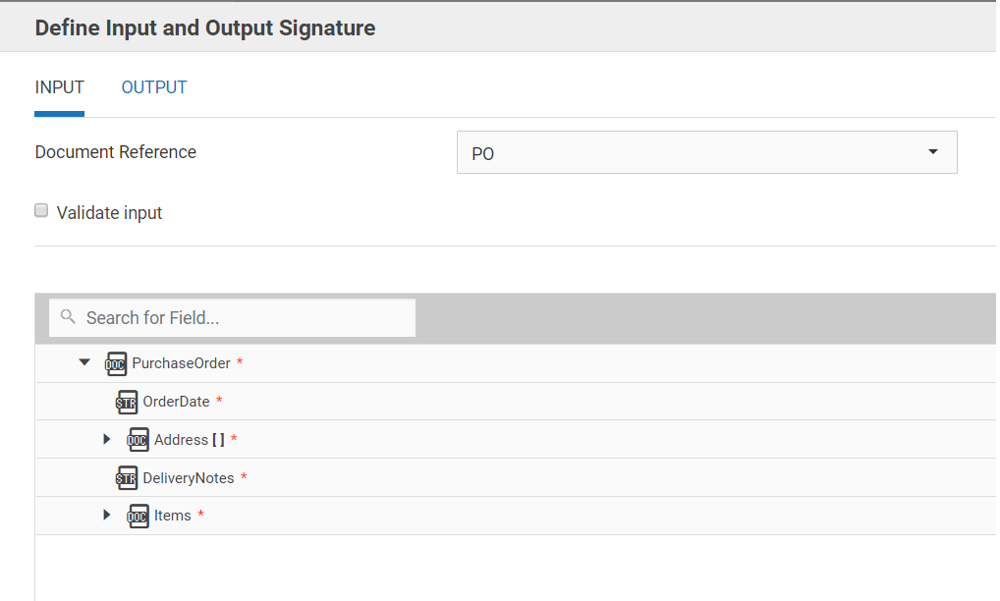

- Following code snippets or steps needs to be put in this flow service. In this service map to EDI document, Convert to EDI message and submit to B2B cloud

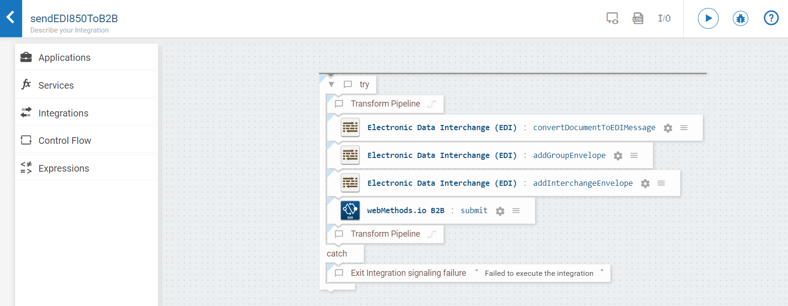

10. This newly created integration will be available under webMethods.io  Flows on right hand side menu. Drag and drop to canvas and map as shown below.

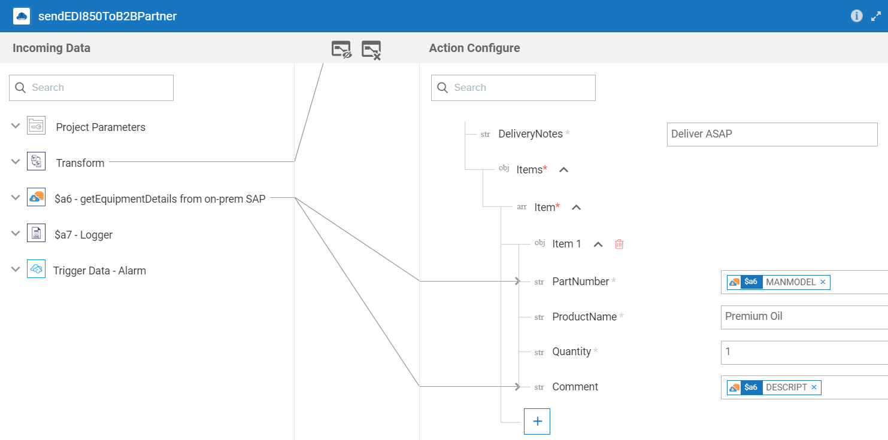

11. Connect Salesforce Editor and Flow to end. Your integration is complete now. Final workflow should look like something below.

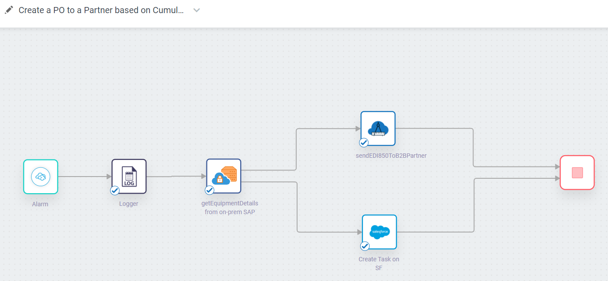

## Testing

1. Run workflow using the Debug capabilities. Flow should run succesfully.

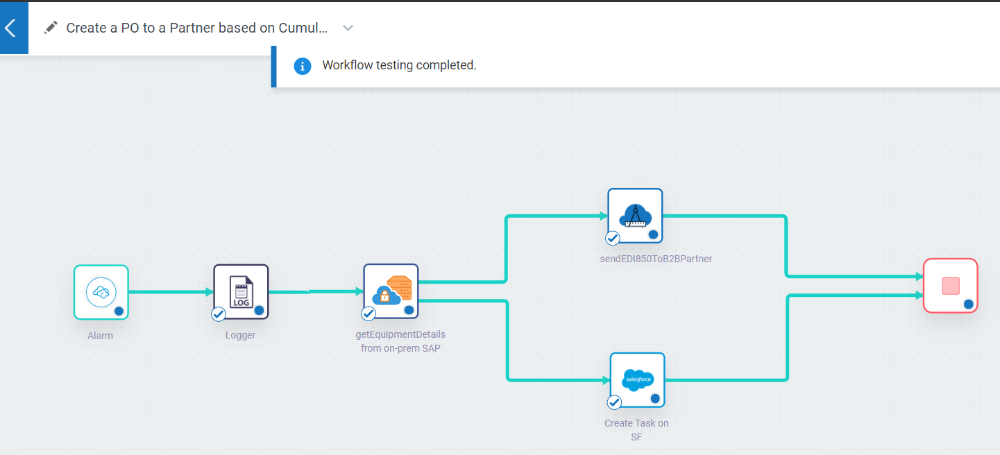

2. All the actions should be completed like below.

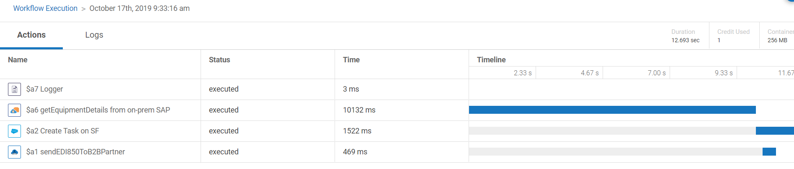

3. On B2B Cloud, click on Transactions to monitor documents as shown below

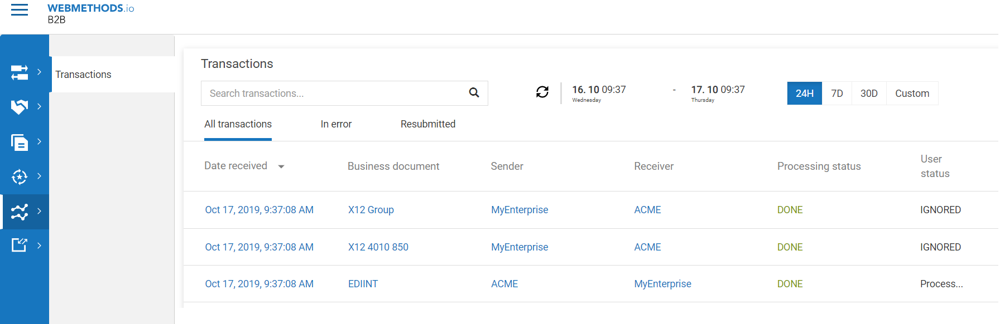
