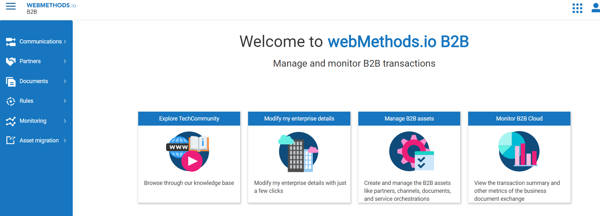
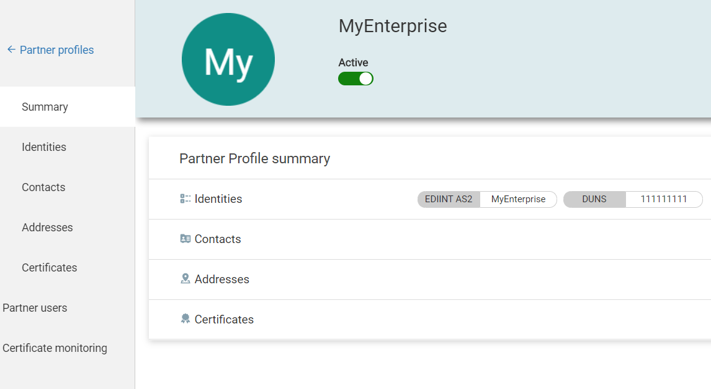

# Send a Purchase Order EDI 850 based on Alarm from Cumulocity

This examples highlights that how an Alarm generated using cumulocity platform can be easily converted to an EDI document and send to Enterprise partner for further processing. In this example cumulocity is monitoring a Tank and reporting content level back. There is a Smart Rule which is constantly looking at Tank Level and raises an alarm as soon as content goes below critical level. Once the alarm is raised, a workflow is triggered on wm.io platform which intern create an EDI 850 document and route document to Partner via B2B cloud. Lot of manufacturer are moving into continue manufacturing model, using a setup like this can help them achieve continue manufacturing very well.

Contributors: Shashank Patel, Mangat Rai

## Prerequisites
1. You need Software AG webmethods.io B2B cloud tenant, webmethods.io integration cloud tenant and cumulocity cloud tenant. This tutorial assume that you already have a device connected with cumulocity platform and have smart rule created to raise alarm on Tank Level.

If you don't have one; sign up for free 30 trial tenant at [Software AG B2B](https://signup.softwareag.cloud/#/?product=b2b)

2. Create your enterprise Partner profile on B2B Cloud. Provide identifiers to identify your Enterprise uniquely.

## Transaction Flow
1. Partner (Postman client) sends EDI 850 to B2B Cloud via AS2 over HTTP
2. B2B Cloud identifies the EDI document Type, Sender and Receiver 
3. B2B Cloud executes the processing rule based on a criteria for senderid, receiverid, document type
4. B2B cloud executes the action defined in processing rule which is configured to call webmethods.io Integration for further mapping. The integration does the following
	- Receive EDI 850 file and send FA EDI 997 back to the partner
	- Parse EDI 850 file 
	- Convert the EDI file to XML
	- Send the XML file to back-end Application via FTP
	- Receive a response from back-end Application via FTP
	- Transform the Application response to EDI 855
	- Submit the EDI 855 back to B2B Cloud
	- B2B Cloud delivers EDI 855 message back to the Partner

## Tutorial Steps
1. Create an inbound AS2 channel on Software AG B2B Cloud which is open for inbound AS2 communication from Partner ACME.

2. Create an outbound AS2 channel on Software AG B2B Cloud which is open for outbound AS2 communication to Partner ACME.

3. Create a partner profile. Before this the assumption is you have already created an Enterprise for your company to receive files. Setting an Enterprise is a one time setup

	ACME Partner setup
	

4. Add a EDI 850 and 855 business document. This process will create a document type in webMethods Flow Editor , so it will be easy for mappings to be done when a processing rule executes an Integration as part of the action

Follow the same step to add EDI 855 as well

5. Create a processing rule to process inbound EDI 850 to identify the sender , receiver, document type and action

Add Processing rule

Give a name

Associate sender/s

Associate document/s

Provide the name of Integration that you are going to create and expose on webmethods.io Integration in the next step

6. Create an Integration on webmethods.io Integration which parses EDI 850 and converts to XML and sends this XML document to backend Application. Then, receives a response from backend and submits EDI 855 back to B2B

- Switch to flow editor

- Click on Recipes and search for edi. You will see receiveEDI850Send855B2BTransactions recipe. Use this recipe.

- Select a project and fill out the application details. If an application is not created , create a new application for each account. This flow assumes you have connectivity to an ftp server. if you dont have one , you can sign up for a free ftp server on https://hostedftp.com/ or https://DriveHQ.com

- See the following code snippet

- After successful import

## Testing

1. Download postman collection - [postman](B2B%20wm.io.postman_collection.json) and import it on Postman. Modify Message-Id field in the Request header and submit it to the Inbound channel URL.

2. On B2B Cloud, click on Transactions to monitor documents as shown below

