# Reprocess and Resubmit EDI transactions
Information about documents exchanged in webMethods.io B2B is available on the Transactions page. Details of erroneous and resubmitted transactions are also listed in this page. 
You can view the summary of transactions such as date received, business document name, sender, receiver, processing status, user status, and so on. The search is not case-sensitive.

## Prerequisites
1. You need Software AG webmethods.io B2B cloud tenant and webmethods.io integration cloud tenant. If you don't have one; sign up for free 30 trial tenant at [Software AG B2B](https://signup.softwareag.cloud/#/?product=b2b)

## Reprocessing an Invoice 810 EDI document

When you reprocess a document, you send the document back through the processing rules. 
For example, you will reprocess a document if the document was processed by the wrong processing rule.

The initial processing rule was "Receive810FromCostco" where Sender=Costco, Receiver=Hilton and Document Type=Any. This processing rule will invoke the service Process850Order 
service in Webmethods.io flow integration. 

Now we receive the document from Costco where Receiver is Hilton and Document Type=810. The 810 EDI document there are 2 transactional set (ST/SE segments) so we could see 2 X12 4010 810 transactions.
For each transaction the execution is different.
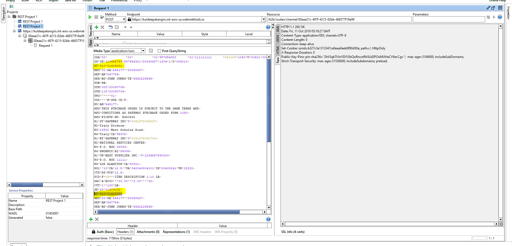
 

The Processing rule "Receive810FromCostco" is invoked as this is the top processing rule which is matching the criteria.
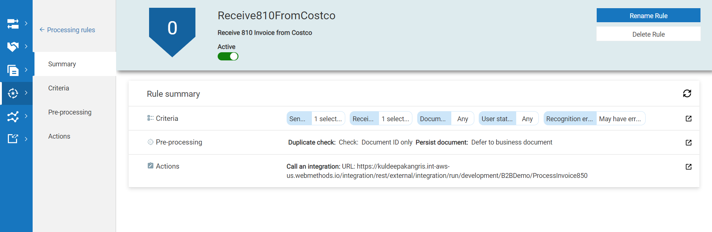

We could see error as the processing rule is invoking the wrong service in Webmethods.io flow integration. We can See the complete error description in summary. 
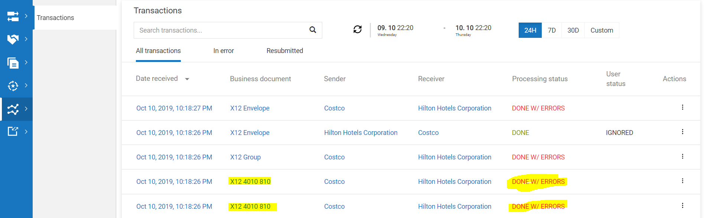	
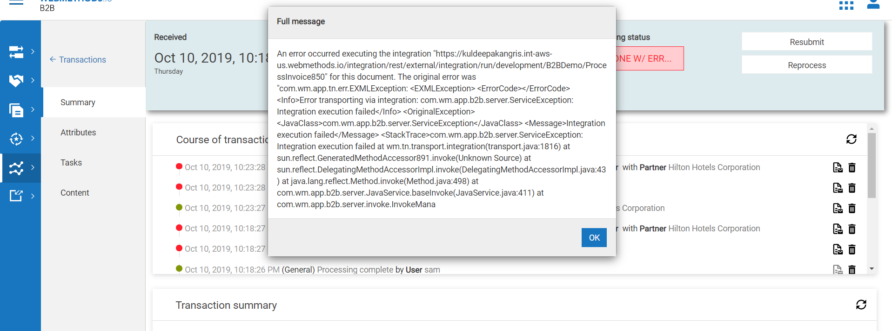

Now Let’s correct the processing rule "Receive810FromCostco" to invoke the correct service in Webmethods.io flow integration. Now let’s add the document type=x12 4010 810 as well
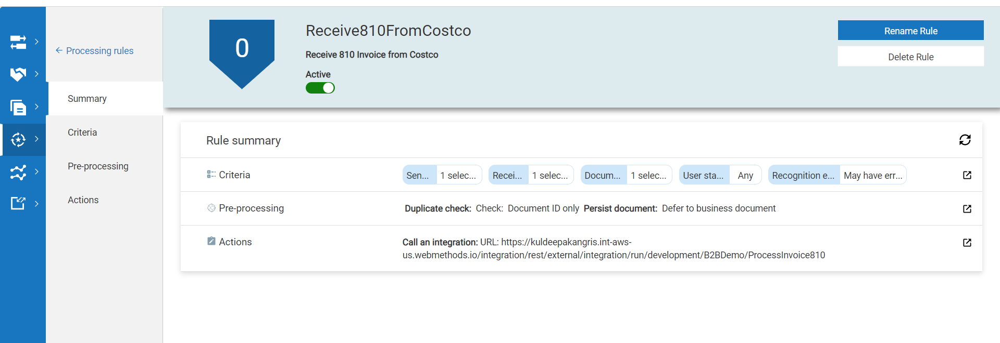

Reprocess the 810 transaction by selecting the reprocess. After the reprocess the transaction status will get changed to "REPROCESSED".

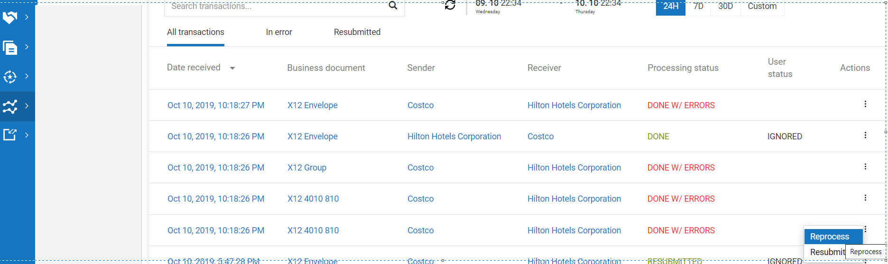
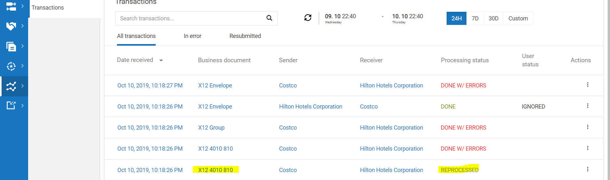

## Editing and Resubmitting an Invoice 810 EDI Document.

When you resubmit a document, you send the document to webMethods.io B2B as a new document. 
For example, you might resubmit a document when the document does not match any type of business document.  
When you edit a document and resubmit it, webMethods.io B2B creates a new instance of the document, and continues to process it while the original document remains unchanged.
While submitting the original document the ST segment was spelled as ST1 instead of ST.

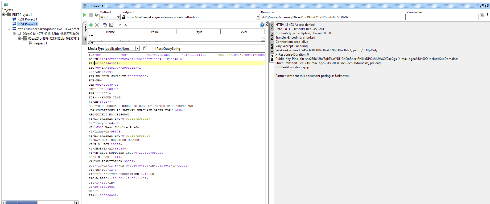

This transaction will be in Aborted status as the B2B cloud failed to recognize the document. If any transaction is failed because of the data issue the Resubmit option will allow us to edi the transactional data before the resubmit.
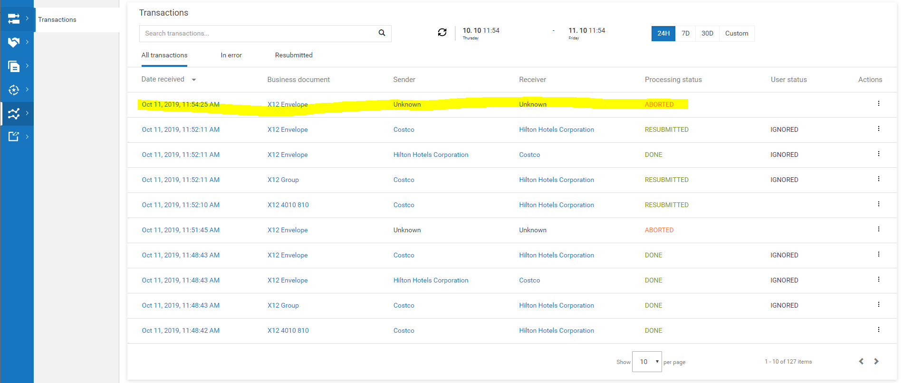

Open and cross verify the Aborted Transaction and you can see the error summary which describes the error details.
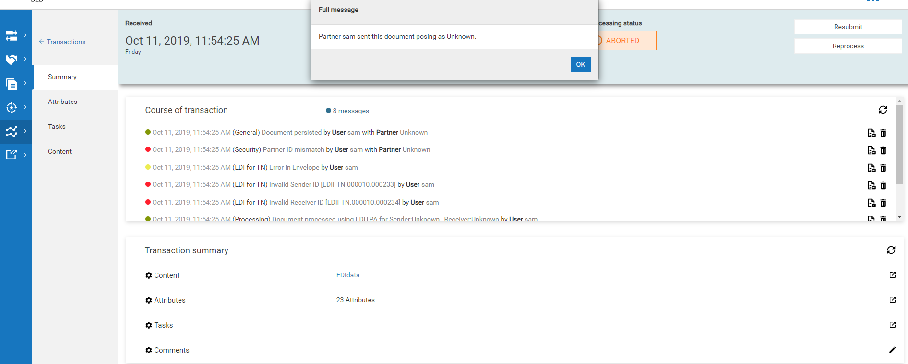

In the same page go to Content and you can edit the content before clicking on the resubmit. Edit the ST segment by changing ST1 to ST and click on the resubmit.
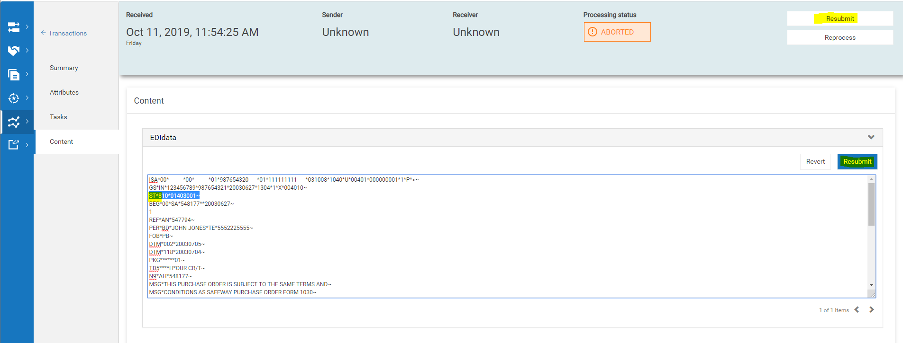

After resubmitting we can see the transactions in b2b transaction page. Resubmit will create the new transaction with the status "RESUBMITTED".
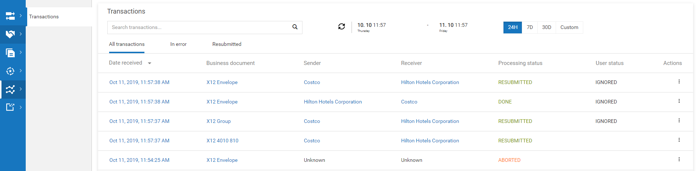
